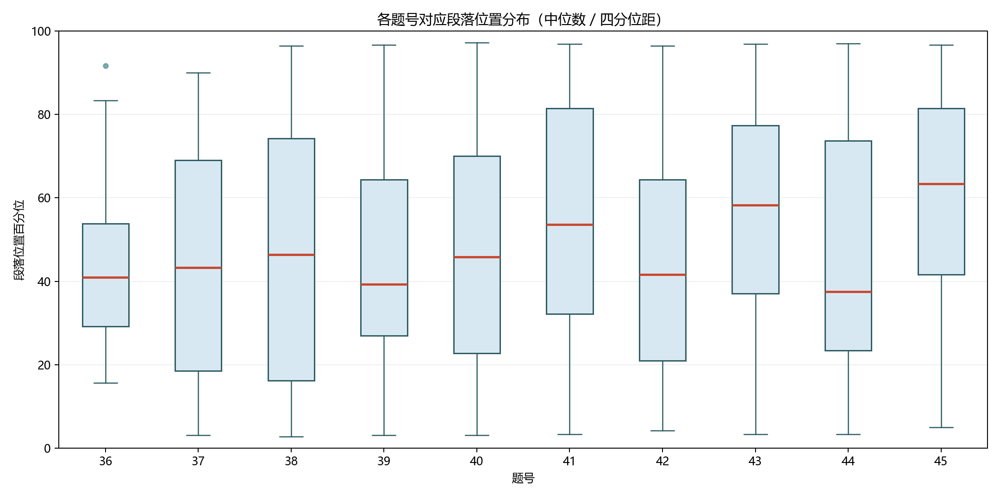
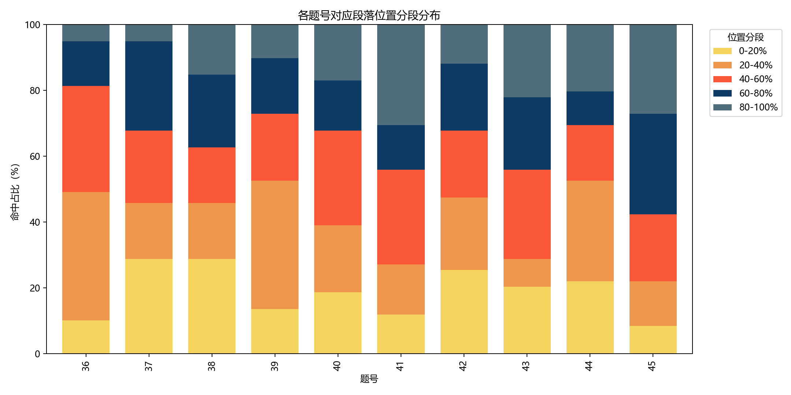
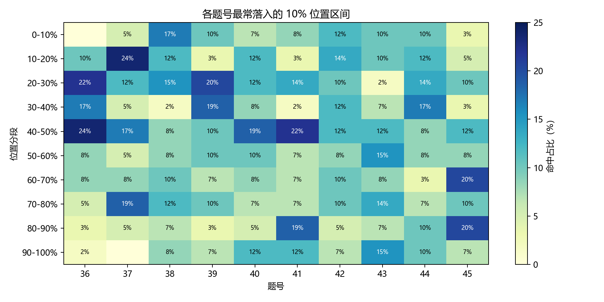
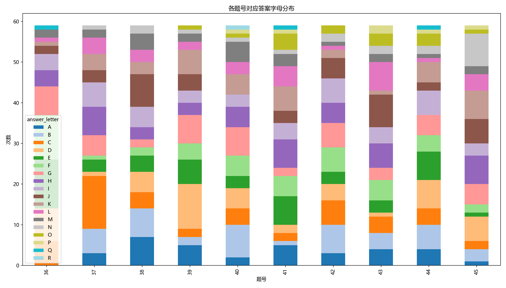
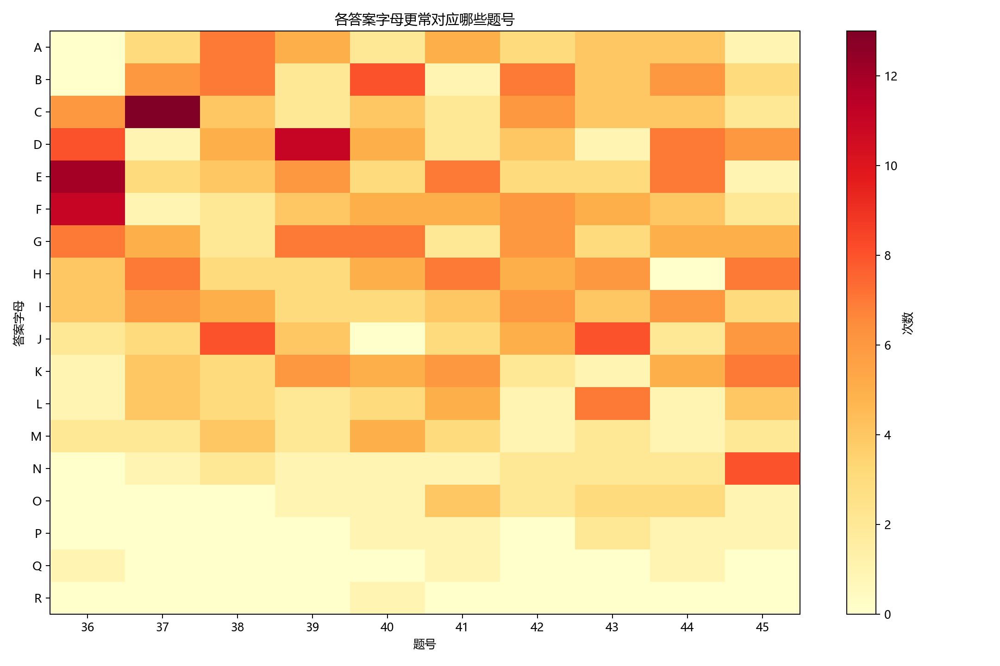

# 六级长篇段落匹配做题规律总报告

## 摘要

这份报告主要回答两个问题。

第一，长篇段落匹配这十道题，拿到手以后先做哪几道更适合优先处理。第二，某一道一旦做出来了，下一道更该往文章哪里找。

本文使用的是同一批完整样本，一共 59 套题，也就是 590 道题。后面所有主要结论，默认都来自这同一批样本。

如果先看结论，可以先记 6 句：

1. 不要按题号从前往后顺着做。
2. 开局更适合先从第三十七题、第三十九题、第四十一题、第四十五题里挑最好定位的一题。
3. 第三十八题、第四十二题、第四十三题，默认更适合后做，等别题先帮它们缩小范围。
4. 相邻题通常不是原文里的就近题，反而中间隔一道题的组合更值得一起看。
5. 第四十四题一旦做出来，先看它能帮助判断哪些题。
6. 前百分之四十、前百分之五十、以及每个五分之一小区间里已经放了多少题，建议一直记着，以免把过多题目集中到同一区间。

---

## 第一章 先把这份报告看懂

### 1.1 这份报告到底在帮你解决什么

长篇段落匹配题里，常见的误判有两种。

第一种误判是：觉得只要记住“某题平均偏前”“某题平均偏后”就够了。但这还不够。因为做题时，不是同时处理十道题，而是先做出几题，再利用这些题去帮助别题。

第二种误判是：觉得题号相邻，原文位置也大概率相邻。实际数据并不支持这个想法。很多时候，相邻题在原文中的距离并不近；更适合关注的，反而是中间隔一道题的组合。

所以，这份报告不是把第三十六题到第四十五题看成十道互不相干的题，而是把它们看成一个连续推进的过程：

1. 先用较容易定位的题建立初始判断。
2. 一边做一边记录区间占用，防止某个区间放进太多题。
3. 一旦做出一道题，就立刻利用它去缩小别题搜索范围。
4. 最后再用段落字母偏向、已用段这些较弱线索来收尾。

### 1.2 样本口径只有一个

这里先把样本说明写清楚：我们一共看了 59 套真题，每套长篇段落匹配题都有 10 道题，所以总共是 590 道题。

这表示后面的大部分图、表和结论，都是在同一批完整样本上算出来的。也就是说，后面的主要统计口径是一致的。

### 1.3 “位置百分比”到底是什么意思

后面很多图都会写“前百分之二十”“百分之二十到百分之四十”“百分之四十到百分之六十”这种区间。它们说的不是固定第几段，而是“在整篇文章里的相对位置”。

可以这样理解：

1. 如果一篇文章有 10 段，那么前百分之二十大致就是最前 2 段，百分之二十到百分之四十大致就是第 3 到第 4 段，最后百分之二十大致就是最后 2 段。
2. 如果一篇文章有 12 段，那么前百分之二十大致就是最前 2 到 3 段，百分之二十到百分之四十大致就是第 3 到第 5 段，最后百分之二十大致就是最后 2 到 3 段。

所以，后面所有百分比分段，你都可以先把它理解成“文章前面一小截”“文章中间某一块”“文章最后一小截”，不要把它想成固定段号。

### 1.4 底层明细表和汇总表，实际都在记什么

这一节不再放英文变量名和文件名，只直接说明：底层表和汇总表里，常见的内容分别是什么意思。

| 表里常见的内容 | 直接理解成什么 |
| --- | --- |
| 题号 | 也就是第三十六题到第四十五题这些编号 |
| 正确段落的字母 | 注意，这不是四个选项那种字母，而是原文段落自己的字母标签 |
| 正确段落的大概位置 | 说的是这道题通常落在文章前面、中间还是后面 |
| 最常见的大区间 | 说的是这题平时最常出现在文章哪一大块 |
| 两题是否经常挨得很近 | 说的是两道题在原文里差不超过两段的情况多不多 |
| 两题是否常在同一半篇 | 说的是它们是不是经常一起都在前半篇，或者一起都在后半篇 |
| 两题平时大概隔几段 | 说的是这两题在原文里通常离多远 |
| 某题做出后能不能明显帮到别题 | 说的是这题一旦做出来，另一题会不会突然更好找 |

| 常见的汇总表 | 这份表大概在管什么 |
| --- | --- |
| 单题粗位置汇总表 | 每道题大概更常在文章哪一块出现 |
| 单题细位置汇总表 | 每道题更细一点的位置分布 |
| 题号对应段落字母汇总表 | 每道题更常对应哪些段落字母 |
| 段落字母反查题号汇总表 | 某个段落字母更常被哪些题用到 |
| 两题关系汇总表 | 任意两道题放在一起时，大概是什么关系 |
| 条件联动汇总表 | 某题一旦做出来，会怎样改变别题搜索范围 |

### 1.5 这 5 张图到底该怎么读

下面会反复用到 5 张图。你不用掌握统计术语，只需要知道它们分别对应什么操作。

#### 1.5.1 单题位置箱线图

这张图主要回答两件事：

1. 这题整体更偏前还是偏后。
2. 这题的位置是否集中。

你看这张图时，不用记统计术语，只要看 3 件事：

1. 整体高不高。越高，说明越偏后；越低，说明越偏前。
2. 中间那个黑箱子短不短。短，说明这题分布更集中；长，说明这题分布更分散。
3. 两头尾巴长不长。尾巴越长，说明这题越可能出现在其他位置。

可以按 3 种情况处理：

| 图上长什么样 | 你该怎么做 |
| --- | --- |
| 中间黑箱子短，两头尾巴也不长 | 这种题可以较早处理，适合先帮助判断大方向 |
| 中间黑箱子不算长，但两头还有明显尾巴 | 这种题可以当方向参考，但不要只靠这一个信号 |
| 中间黑箱子本身就长，或者两头拖很长 | 这种题可以暂时后放，等其他题提供更多信息 |

#### 1.5.2 单题二成分带图

这张图主要回答一句话：这道题第一眼先去文章哪一块找。

可以先看哪种颜色最厚。最厚的那块，就是第一眼先看的区间；第二厚的那块，就是第一眼没找到时补看的区间。

比如：

1. 如果后段颜色最厚，动作就是先往后看，不要先在前面反复停留。
2. 如果前中段颜色连续更厚，动作就是先从前中段开始找，先看有没有和题干重复的关键词。
3. 如果前几块颜色差不多厚，动作就是先不要单独依赖这题判断，等别题来帮它缩范围。

#### 1.5.3 单题一成热区图

这张图比上一张更细。它不是在问“先看前面还是后面”，而是在问“这题是不是主要集中在同一块区域”。

读法也很简单：按列看。

1. 如果一列里只有一个明显深色块，说明这题大多还是集中在一块地方。
2. 如果一列前后两头都深，中间反而不突出，说明这题经常前后都会去，这类题不适合只记一个平均位置。
3. 如果一列很多地方都差不多深，说明这题单独看时很难给出清楚方向，最好等别题先做出来。

像第三十七题、第四十一题、第四十五题，就更容易出现“前后两头都常见”的情况。

#### 1.5.4 题号对应段落字母分布图

这张图容易误读，先说明一点：

这里的字母，是原文段落字母，不是四个选项那种字母。

这张图不适合用于开局。它只适合最后两个候选都很像时，帮你二选一。

可以这样用：平时不要靠它直接定答案，只有最后两个候选都差不多时，才用它帮你排先后。

#### 1.5.5 段落字母反查题号图

上一张图是“从题号看字母”，这一张是“从字母看题号”。它更适合在你已经盯住某个候选段以后，反过来问自己：这个段更像给哪道题。

这不是开局图，而是最后二选一时才使用的图。

如果你已经有两个候选段都挺像，这时可以用它看看：这个字母更常对应前段题，还是更常对应后段题。它只能作为补充参考，不能单独决定答案。

#### 1.5.6 这 5 张图到底按什么顺序看

可以按下面 4 步看：

1. 先看二成分带图，决定先去前面、中间还是后面找。
2. 再看箱线图，判断这题适不适合早做。
3. 再看一成热区图，确认它会不会前后乱跑。
4. 最后才看两张字母图，只在收尾时用。

如果只想记一张小表，可以直接看下面这张：

| 图表 | 这张图在回答什么 | 你看完该立刻干什么 | 最容易看错的地方 |
| --- | --- | --- | --- |
| 单题位置箱线图 | 这题偏前还是偏后，稳不稳 | 决定这题能不能较早动手 | 最容易把图上中间那条线误当成精确段号 |
| 单题二成分带图 | 第一眼先去文章哪一块找 | 决定先看哪块，再给自己留一个补看区 | 最容易把最厚颜色误当成“只有这里才可能对” |
| 单题一成热区图 | 这题是待在一块，还是前后都会跑 | 决定它能不能单独做 | 最容易把深色块误当成“肯定就在这里” |
| 题号对应段落字母分布图 | 这题更常对应哪些段落字母 | 只在最后给候选排先后 | 最容易把字母误看成四个选项那种字母 |
| 段落字母反查题号图 | 某个字母更像给哪道题 | 反查某个候选段更像哪题 | 最容易把它误当成开局依据 |

---

## 第二章 单独看每一道题时，最该记住什么

### 2.1 十道题的大概落点

先只看单题自己平时大概落在哪。下面这张表先汇总主要信息。

| 题号 | 第一眼先看哪里 | 第一眼没找到再看哪里 | 最容易误判什么 | 直接操作 |
| --- | --- | --- | --- | --- |
| 第三十六题 | 前百分之二十到百分之四十，约占三成七 | 百分之四十到百分之六十，约占三成四 | 容易把它想得太靠前或太靠后 | 先从前半到中部找，适合拿来判断大方向 |
| 第三十七题 | 前百分之二十，约占三成 | 百分之六十到百分之八十，约占二成七 | 容易把它固定看成前段题 | 前后都要防，别只记一个位置 |
| 第三十八题 | 前百分之二十，约占二成七 | 百分之六十到百分之八十，约占二成三 | 容易觉得它也能早做 | 它自己太散，默认后做更稳 |
| 第三十九题 | 百分之二十到百分之四十，约占三成九 | 百分之四十到百分之六十，约占二成一 | 容易低估它做出来后对别题的帮助 | 很适合拿来当较早做的题 |
| 第四十题 | 百分之四十到百分之六十，约占二成九 | 百分之二十到百分之四十，约占二成一 | 容易因为挨着第四十一题就去附近连找 | 更像中段题，但别顺题号找 |
| 第四十一题 | 最后百分之二十，约占三成二 | 百分之四十到百分之六十，约占二成九 | 容易把它固定看成最后一题附近 | 偏后，但不是永远只在最后 |
| 第四十二题 | 前百分之二十，约占二成七 | 百分之二十到百分之四十，约占二成一 | 容易在没有别题帮助时单独处理 | 默认先放一放，等别题来缩范围 |
| 第四十三题 | 百分之四十到百分之六十，约占二成九 | 前百分之二十，约占二成一 | 容易以为它会很稳地待在中后段 | 它不算很稳，也适合晚一点处理 |
| 第四十四题 | 百分之二十到百分之四十，约占三成 | 前百分之二十，约占二成一 | 容易只把它当成普通中段题 | 它更有价值的地方在于做出后能帮助别题 |
| 第四十五题 | 百分之六十到百分之八十，约占三成二 | 最后百分之二十，约占二成三 | 容易把它想成永远最后一道 | 大多偏后，但也不要固定看成最后一段附近 |

先从这张表里记住 3 点：

1. 第三十六题、第三十九题、第四十四题，更像前中段题；第四十一题、第四十五题，更像后段题。
2. 第三十七题、第四十一题、第四十五题，最怕你只记一个平均位置，因为它们经常前后都会出现。
3. 第三十八题、第四十二题、第四十三题，自己更散，所以默认更适合晚一点处理。

这里还要专门解释一下第四十一题，因为它最容易让读者觉得前后信息不一致。粗分带里，它最常见的大区间是最后百分之二十，但更细的小区间里，文章中后部也很热。这不是矛盾，而是在提醒你：它粗看偏后，细看却经常落在中后部，所以不能把它固定看成“最后一段附近”。

### 2.2 谁适合先做，谁更适合后做

知道每题大概在哪，还不够。你还要知道它们在整套题里分别适合干什么。

| 题号 | 为什么可以先做或后做 | 更适合什么时候动它 | 做出来后较常帮助谁 |
| --- | --- | --- | --- |
| 第三十六题 | 自己相对稳，但通常不是最容易最先确认的题 | 文章大方向还不清楚时 | 主要帮你判断全文大概该先看前半还是中部 |
| 第三十七题 | 如果文章前面已经有实质内容，它比较容易先被识别出来 | 开头不是纯背景时 | 常能帮助定位第三十九题 |
| 第三十八题 | 自己太散，单独处理成本高 | 等别题先帮它缩过范围以后 | 有时能反过来帮前面的题，但不适合抢先做 |
| 第三十九题 | 位置相对稳，而且经常能继续帮别题 | 适合用于开局 | 常能帮助判断第四十一题、第四十四题 |
| 第四十一题 | 偏后，而且一旦做出，经常会改变别题的搜索方向 | 想确认后半篇怎么找时 | 常能帮你重新看第四十题、第四十二题 |
| 第四十四题 | 自己不一定最集中，但做出来后经常能帮助多道题 | 只要一做出来就优先利用 | 较常帮助第四十五题、第四十一题、第四十三题、第四十二题 |
| 第四十五题 | 偏后，适合帮你确认“后面是不是更值得找” | 想确定后段价值时 | 经常能帮你判断该不该继续把重心放在后面 |

比如第四十一题做出来以后确实能帮助很多题，但它不一定是最省力的第一题。相反，第三十九题带来的后续变化没有那么集中，但更常适合作为较早处理的一题。

### 2.3 容量账本为什么必须一直记

只看单题热区时，常见问题是：容易过早把很多题集中到同一块地方。

容量账本就是用来防止这个问题的。可以直接按下面三条理解：

| 你现在已经记到的情况 | 这时该怎么做 | 为什么 |
| --- | --- | --- |
| 前百分之四十已经放了四题 | 后面的题先多怀疑中后段，不要再轻易往前塞 | 样本里前百分之四十最常见就是四题 |
| 前百分之五十已经放了六题 | 剩下的题先优先往后看 | 前半篇的容量大多已经快满了 |
| 某个五分之一小区间已经有三题 | 除非证据特别强，否则先去别处再核一遍 | 单个小区间塞到四题的情况很少 |

举例说明。

假设你已经把第三十六题、第三十七题、第三十九题、第四十四题都放进了前百分之四十。这时第四十题看起来也有一点像前段题，你就不应该再直接把它放进去。更合适的做法是先去中段或后段再找一圈，看有没有更像的候选。

如果你习惯用段数来想，可以这样换算：

1. 如果一篇文章有 10 段，那么“先看连续百分之四十篇幅”差不多就是先重点看连续 4 段。
2. 如果一篇文章有 12 段，那么差不多就是先重点看连续 5 段左右。

---

## 第三章 题和题之间，哪些关系可以直接用于做题

### 3.1 相邻题通常不是“就近题”

这一轮新增的重点结论之一是：相邻题通常不是“原文里也挨着”的题。

最典型的几组相邻题如下：

| 相邻题 | 在原文里差不超过两段的比例 | 直接结论 |
| --- | ---: | --- |
| 第四十题和第四十一题 | 3.57% | 基本不适合做出第四十题后，接着去附近找第四十一题 |
| 第四十一题和第四十二题 | 8.93% | 这两题也不适合顺着连找 |
| 第四十三题和第四十四题 | 0% | 在现有样本里，它们几乎从来没贴在一起过 |
| 第四十四题和第四十五题 | 7.14% | 编号相邻，但原文位置常常被拉开 |

所以这张表主要对应一条动作：不要因为题号挨着，就以为原文里也该挨着找。

### 3.2 更适合一起看的，是中间隔一道题的组合

反过来，更值得一起看的，往往是中间隔一道题的组合。

| 组合 | 在原文里差不超过两段的比例 | 直接结论 |
| --- | ---: | --- |
| 第三十七题和第三十九题 | 51.79% | 很值得一起看，经常一题出来，另一题就在附近或同一片区域 |
| 第三十六题和第三十八题 | 41.07% | 也明显强于大多数相邻题 |
| 第四十三题和第四十五题 | 41.07% | 在后半篇里，这组也更像一对 |

所以，如果你要记“更适合成对看”的组合，优先记的不是顺题号一路往下推，而是：

1. 第三十七题和第三十九题。
2. 第三十六题和第三十八题。
3. 第四十三题和第四十五题。

### 3.3 一题一旦做出来，下一题该往哪里找

这一节直接对应考场动作，因为考场上的实际问题不是“平均来说这题在哪”，而是“既然这题刚刚已经做出来了，我下一题先去哪里找更省时间”。

下面只保留几条可以直接改动作的规则：

| 你已经知道的情况 | 下一题先看谁 | 下一题先在哪一块找 | 为什么可以参考这条规则 |
| --- | --- | --- | --- |
| 第三十九题已经在最前百分之二十 | 第四十一题 | 先看最后百分之四十 | 样本里类似情况一共 8 次，第四十一题这 8 次都在后百分之四十 |
| 第四十四题已经在最前百分之二十 | 第四十五题 | 先看最后百分之四十 | 样本里类似情况 12 次里有 11 次都这样 |
| 第三十七题已经在最前百分之二十 | 第三十九题 | 先看百分之十到百分之五十 | 它会把第三十九题的搜索范围明显缩小 |
| 第四十二题已经在百分之二十到百分之四十 | 第四十四题 | 先看前百分之四十 | 样本里 12 次有 11 次都落在这里 |
| 第四十二题已经在百分之二十到百分之四十 | 第四十五题 | 先看百分之五十到百分之九十 | 同一条条件，还会把第四十五题往后推 |
| 第四十一题已经在最后百分之二十 | 第四十题 | 先看百分之二十到百分之六十 | 这条规则用于避免把第四十题也放到第四十一题附近去找 |
| 第四十三题已经在百分之六十到百分之八十 | 第四十四题 | 先看前百分之四十 | 这条规则用于修正“第四十三题靠后，第四十四题也该跟着靠后”的误判 |
| 第三十七题已经在百分之六十到百分之八十 | 第三十六题 | 先看百分之十到百分之五十 | 它提醒你别因为题号接近，就直接往后找第三十六题 |

这张表主要对应 3 种动作。

第一种动作是“换区”。比如第三十九题已经在最前百分之二十，那就不要继续在中段反复看第四十一题，而是直接把注意力转到后百分之四十。

第二种动作是“先缩范围再找”。比如第四十二题已经在百分之二十到百分之四十，那第四十四题先看前百分之四十，第四十五题先看百分之五十到百分之九十。这样做不是直接猜答案，而是先把原本太大的搜索区缩成更容易检查的区域。

第三种动作是“修正顺题号找的习惯”。例如第四十一题已经很靠后时，第四十题反而要先往中段看；第四十三题已经偏后时，第四十四题反而要先往前看。

### 3.4 这一章可以先记什么

这一章可以先记 4 句话。

第一，相邻题通常不是就近题，所以不要顺题号推进。

第二，中间隔一道题的组合更值得利用，尤其是第三十七题和第三十九题、第三十六题和第三十八题、第四十三题和第四十五题。

第三，某题一旦已经落在很前或很后的位置，它对下一题的方向提示会明显变强。这时要及时改方向，不要继续按“平时大概在中间”的思路去找。

第四，第四十四题一旦做出来，可以优先利用；字母图则相反，只适合最后两个候选都差不多时才拿出来帮你二选一。

---

## 第四章 考场实战：从拿到题到做完题

### 4.1 开做前 30 秒，先做什么

刚拿到长篇段落匹配题，不要马上冲进文章里挨段读。先用大约 30 秒把 10 个题干过一遍。

这 30 秒只做 3 件事：

1. 圈出最容易在原文里一眼认出来的东西，比如专有名词、数字、年份、百分比、引号、明显转折。
2. 粗看哪几题像定义句。最常见的信号，是题干里在解释“某个概念到底是什么意思”。
3. 粗看哪几题像总述或总结。最常见的信号，是题干在总括判断、收束全篇、概括前文。

### 4.2 第一轮怎么开局

第一轮不是为了做完，而是为了先把全文的大致区域分开。

开局可以直接按下面的顺序做：

1. 如果文章前 1 到 3 段已经有明显观点、定义、案例、转折，那就先从第三十七题或第三十九题下手，先只看前段到中段里有没有和题干重复的关键词；有就停下来细看，没有就看下一段。
2. 如果文章前面大多只是背景和铺垫，真正信息明显在后面，那就先从第四十一题或第四十五题下手，先只看中后段和后段里有没有和题干重复的关键词；有就停下来细看，没有就继续往后。
3. 如果一时判断不出来，就先用第三十六题或第三十九题来试方向，因为它们相对更稳。
4. 如果某题自己很散，比如第三十八题、第四十二题、第四十三题，而你手里又没有别的线索，那就先放着。

当多道题看起来都能先做时，优先级可以尽量固定一些：

1. 最容易在原文里一眼认出来的题先做。
2. 如果都差不多，就先做更能帮你判断全文大方向的题。
3. 如果还差不多，就先做相对更稳的题。

### 4.3 每做出一题，都要记账

账本不用复杂，可以只记这 3 行：

前百分之四十等于 0，前百分之五十等于 0  
五个小区间分别是：0 / 0 / 0 / 0 / 0  
下一步先看：

比如：

1. 如果第三十七题落在前百分之二十，就记成：前百分之四十等于 1，前百分之五十等于 1，五个小区间分别是 1 / 0 / 0 / 0 / 0。
2. 如果第三十九题落在百分之二十到百分之四十，就记成：前百分之四十等于 2，前百分之五十等于 2，五个小区间分别是 1 / 1 / 0 / 0 / 0。

### 4.4 做出一题以后，下一步怎么机械推进

第一轮的目标通常只是先做出 2 到 4 道能开局的题。做出以后，就不要再按题号顺推了，而是立刻问自己：“这道题现在能帮助我判断哪几题？”

可以按下面的方式推进：

1. 如果刚做出的是第三十九题，先去看第四十一题，先看后百分之四十；然后再看第四十四题，先看中段到中后段。
2. 如果刚做出的是第四十一题，先回头看第四十题和第四十二题，先看中段，不要在第四十一题附近硬找。
3. 如果刚做出的是第四十四题，下一步就先去看第四十五题、第四十一题、第四十三题、第四十二题。
4. 如果卡住的是第三十八题、第四十二题、第四十三题这种本来就散的题，就先放着，先去做能帮助它的题。

如果某题在你怀疑的区间里已经从头到尾翻了两遍，还是没有强候选，就先停。把当前最像的那一段记成“候选一”，先不要立刻定下来，然后去做能帮助它的题。

### 4.5 常用的决策卡

这一节只保留常用触发器。每条都尽量写成可以直接执行的句子。

| 如果已经发生了这件事 | 你下一步立刻做什么 | 如果这一带里有两个候选都像，怎么办 |
| --- | --- | --- |
| 第三十九题已经在最前百分之二十 | 先做第四十一题，先看最后百分之四十 | 先不要定下来，回头再看第四十题和第四十四题有没有也一起出现线索 |
| 第三十九题已经在百分之四十到百分之六十 | 不要把第四十一题固定判到最后，先看百分之三十到百分之七十 | 两个都像时，先保留，再看第四十五题或第四十题来帮你排 |
| 第四十一题已经在最后百分之二十 | 第四十题先看百分之二十到百分之六十，第四十二题先看百分之十到百分之五十，第四十四题先看前百分之四十 | 这一轮先别再只盯最后一段附近 |
| 第四十一题已经在百分之二十到百分之四十 | 第四十题反而先看百分之六十到百分之一百，第四十二题先看百分之四十到百分之八十 | 如果后段也有像的候选，就不要被“相邻题应该很近”带偏 |
| 第四十四题已经在最前百分之二十 | 立刻看第四十五题，先看最后百分之四十；然后再看第四十一题和第四十三题 | 如果后段有两个都像，先记候选，不要急着直接定下来 |
| 第四十四题已经在百分之二十到百分之四十 | 先做第四十五题，先看百分之五十到百分之九十 | 如果第四十五题还卡，就回头看第四十一题是否也被一起带后 |
| 第四十四题已经在最后百分之二十 | 不要默认第四十五题也只会待在最后，先把它放宽到百分之三十到百分之七十 | 同时把第四十一题放回中前段再核一遍 |
| 第四十二题已经在百分之二十到百分之四十 | 先做第四十四题，先看前百分之四十；再做第四十五题，先看百分之五十到百分之九十 | 这一组最常见的结果就是一个更靠前、一个更靠后 |
| 第三十七题已经在最前百分之二十 | 先做第三十九题，先看百分之十到百分之五十 | 如果第三十九题也很前，再把第四十一题改到后百分之四十去看 |
| 第三十七题已经在百分之六十到百分之八十 | 不要把第三十六题也往后想，先回到百分之十到百分之五十再找 | 如果前中段里有两个像的，再用第三十九题帮你判断 |
| 第三十八题已经在百分之六十到百分之八十 | 回头先看第三十七题的百分之十到百分之五十，再看第三十九题的百分之二十到百分之六十 | 这时先利用它帮助前面的题，不要继续只围着第三十八题找 |

统一兜底规则也可以单独记一句：如果表里指定的区间你已经从头到尾翻过一遍，还是没有强候选，那就先不要定下来，先把这个题空着，转去做还能继续帮助别题的那道题。

### 4.6 最短执行版

如果最后只想记一张很短的提示单，可以直接记下面这 7 句：

1. 先看题干，先挑最容易在原文里一眼认出来的题。
2. 开头已经有正文，就先看第三十七题或第三十九题；开头像铺垫，就先看第四十一题或第四十五题；看不出来，就用第三十六题或第三十九题先试方向。
3. 第三十八题、第四十二题、第四十三题默认后做，等别题先帮它们缩范围。
4. 每做出一题，都先记账，再问“它现在能帮到谁”。
5. 前百分之四十到 4 题、前百分之五十到 6 题、单个五分之一小区间到 3 题时，先提高警惕，不要再往同一区间继续集中。
6. 第三十九题很前时，第四十一题先往后找；第四十一题很后时，第四十题不要在附近找；第四十四题一出来，立刻去带第四十五题、第四十一题、第四十三题、第四十二题。
7. 已用段和字母只能往后放，不能直接判错。

---

## 第五章 这些规律的依据和使用边界

### 5.1 主要证据

先看第一条基础证据：前半篇和后半篇通常比较均衡，不会极端偏到一边。

| 一套题在前后半篇怎么分 | 这样的卷子有多少套 | 大概占全部样本多少 |
| --- | ---: | ---: |
| 前半篇 5 题，后半篇 5 题 | 35 | 59.3% |
| 前半篇 6 题，后半篇 4 题 | 14 | 23.7% |
| 前半篇 4 题，后半篇 6 题 | 8 | 13.6% |
| 前半篇 7 题，后半篇 3 题 | 1 | 1.7% |
| 前半篇 3 题，后半篇 7 题 | 1 | 1.7% |

这组数据支持“容量账本”这个做法。也就是说，前百分之四十常见放 4 到 5 题，前百分之五十常见放 5 到 6 题，这个范围有样本依据。

第二条证据是：59 套样本里，没有一套是答案位置完全按题号一路顺下去的。

这句话的意义很直接：顺题号做，不是偶尔会错，而是整体上就不符合样本里的常见结构。

第三条证据是在提醒你：同一段被两题同时选中，虽然不常见，但真的可能发生。59 套样本里，有 7 套出现过同一段被两题共用。

所以，“这个段已经被别题用过了”只能降低优先级，不能直接排除。

第四条证据是整体位置分布。把不同长度的文章都换成同一套百分比以后，文章中前部和中部，比文章最开头和最结尾更常出现答案。换句话说，平时更该先重视中段；但一旦你已经确定某题真的落在很前或很后，它又会突然变成很强的改方向信号。这两句话并不冲突，因为一个说的是“平时哪里更常出答案”，一个说的是“很靠前或很靠后这种情况一旦真的出现，下一题该怎么改方向”。

第五条证据说明：统计上看起来影响较大的题，不等于考试里最适合当第一题的题。有些题做出来以后确实能帮助很多题，但它本身并不好做。考试时，仍然要先考虑“哪题现在最省力”，然后再利用这些后续关系。

### 5.2 什么时候不要直接套用

这份报告能帮助调整做题顺序，但它不能代替原文理解。容易误用的地方有 4 个。

| 容易误用的地方 | 更稳的做法 |
| --- | --- |
| 某条条件规则只出现过 8 到 12 次 | 把它当强提醒，不要当成百分之百必中的命令 |
| 第三十七题、第四十一题、第四十五题这种前后都可能出现的题 | 不要只记一个位置，一定要结合别题一起判断 |
| 不同年份、不同文章长度会有变化 | 这些规律更适合先判断前中后，不适合直接押精确段号 |
| 统计结论看起来容易直接套用 | 也不能跳过语义和关键词核对，统计不能替代读懂段意 |

如果把这些边界再写得更直接一点，就是下面 4 句：

1. 只出现过 8 到 12 次的规则，不要当绝对命令。
2. 第三十七题、第四十一题、第四十五题前后都可能出现，不要只记一个位置。
3. 这些统计主要是帮你缩范围，不是帮你直接锁答案。
4. 读不懂段意时，统计也不能替代原文判断。

### 5.3 最后只记这几句话

如果最后不想记太多，可以只记下面这 7 句：

1. 不要按题号顺着做。
2. 先从最好定位的题开局，通常优先看第三十七题或第三十九题，或者第四十一题或第四十五题。
3. 第三十六题是帮你判断大方向的，第三十八题、第四十二题、第四十三题默认后做。
4. 相邻题通常不是就近题，更适合一起看的是中间隔一道题的组合。
5. 第三十九题很前时，第四十一题先往后找；第四十一题很后时，第四十题不要在附近找。
6. 第四十四题一旦做出来，先去看它能帮到谁。
7. 账本要一直记，已用段和字母只能收尾时参考，不能在开局时直接定答案。
